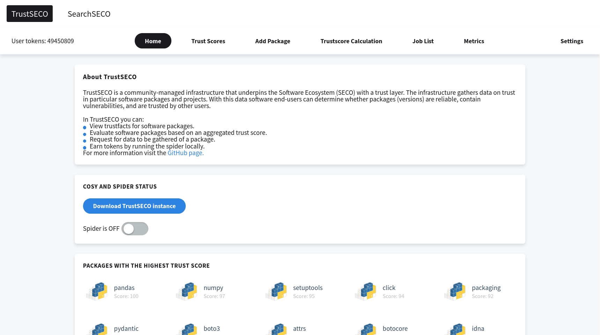
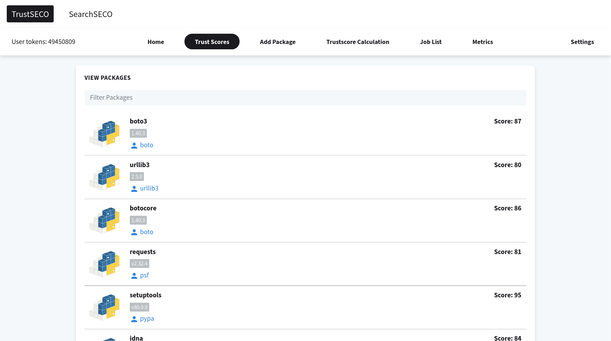
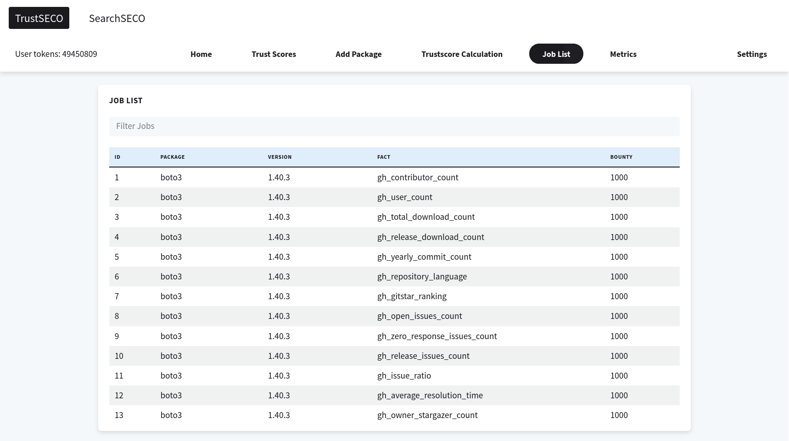
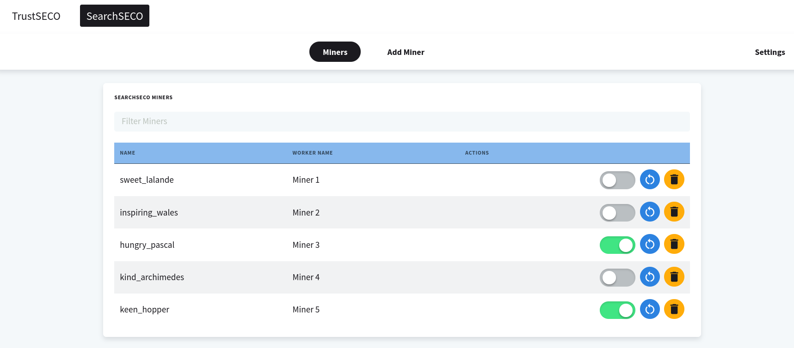
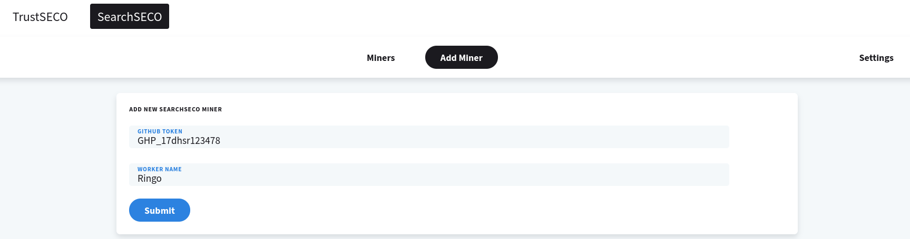

# SecureSECO

This is the mother of the TrustSECO and SearchSECO projects. It combines all together into one docker compose project, with a portal, that can activate all miners.

It consists of the following projects:
- [TrustSECO Spider](https://github.com/SecureSECO/TrustSECO-Spider): simple REST API created with Python and
Flask, where information about packages can be requested, such as the amount of stars a repo has, or how old the
package is.
- [TrustSECO DLT](https://github.com/SecureSECO/TrustSECO-DLT): the distributed ledger where the data of
TrustSECO is stored in a blockchain. Created with Typescript and the Klayr SDK.
- TrustSECO Cosy: This project, it provides a simple API to the Spider, DLT, and controls
the automatic spidering of jobs. It also provides an API for creating SearchSECO instances.
Created with Typescript and Koa.
- [SecureSECO Portal](https://github.com/SecureSECO/SecureSECO-Portal): the frontend of the project where users
can request packages, enable spidering and look at package information of TrustSECO and
add SearchSECO miners, in a easy to use web UI.
- [SearchSECO Controller](https://github.com/SecureSECO/SearchSECOController): Controls the other modules of
the SearchSECO project.

## Features

In TrustSECO you can:
- View trust data for software packages.
- Evaluate software packages based on an aggregated trust score, based on the trust data.
- Request for data to be gathered of a package.
- Earn tokens by running the spider locally. 

## Installation instructions

- Install Docker Compose by following this guide: https://docs.docker.com/compose/install/
- Configure the local environment by copying `example.env` to `.env`, optionally editing the file
- Make the `run.sh` script executable by running the `chmod +x run.sh` command in the correct directory.
- Run the run.sh script by executing `./run.sh` in your terminal.
- Finished! Access the portal by visiting [localhost:3000](http://localhost:3000/).

## Screenshots
### TrustSECO

**Homepage:**

**Packages view:**

**Package view:**

**Add package menu:**

**Job list:**

### SearchSECO

